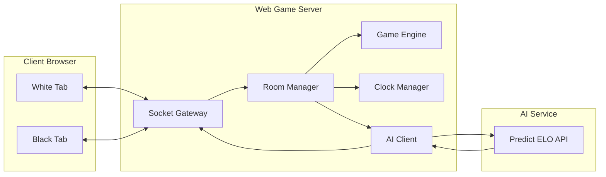
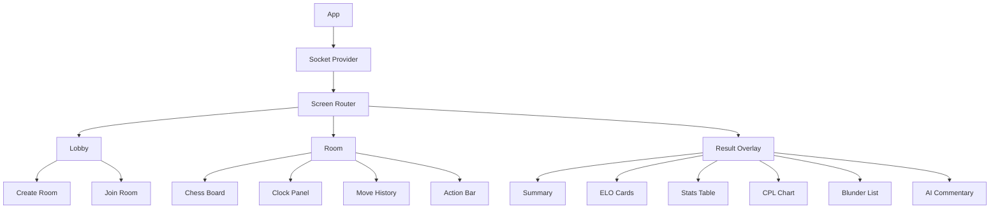
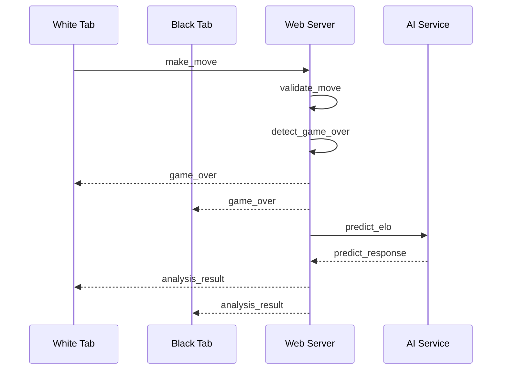
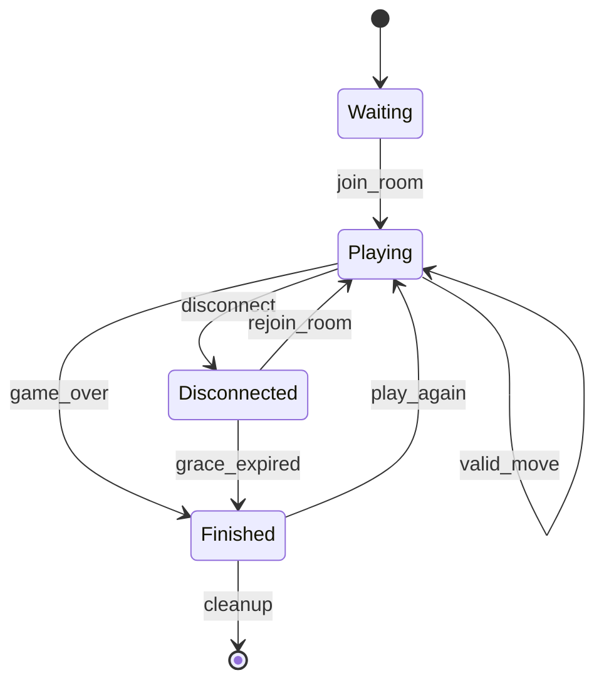

# Whess - Tài Liệu Phân Tích & Thiết Kế Hệ Thống

Phiên bản: 1.0  
Trạng thái: Thiết kế greenfield, dùng để giao nhiệm vụ code frontend và backend  
Phạm vi: Web cờ vua 2 người chơi trên một máy, phân tích AI sau trận đấu  

---

## 1. Tầm Nhìn Sản Phẩm

Whess là một ứng dụng web chơi cờ vua thời gian thực cho 2 người. Trong bản demo, hai người chơi mở hai tab trình duyệt trên cùng một máy, một người cầm Trắng và một người cầm Đen. Sau khi ván đấu kết thúc, hệ thống gửi dữ liệu ván cờ sang AI service để dự đoán ELO, phân tích chất lượng nước đi và sinh nhận xét tiếng Việt.

Trải nghiệm cốt lõi:

1. Người chơi tạo phòng.
2. Người chơi thứ hai vào phòng bằng mã.
3. Hai bên đánh cờ realtime với đồng hồ server-authoritative.
4. Ván kết thúc do chiếu bí, hết giờ, xin thua hoặc hòa.
5. Web Game Server gọi AI service.
6. Frontend hiển thị kết quả, ELO dự đoán, ECO, thống kê CPL, blunder, biểu đồ và nhận xét.

---

## 2. Phạm Vi Demo

### 2.1. Trong Phạm Vi

| Hạng mục | Yêu cầu |
|:--|:--|
| Chơi cờ realtime | 2 tab trình duyệt đồng bộ bằng Socket.IO. |
| Quản lý phòng | Tạo phòng, vào phòng, giới hạn 2 người/phòng. |
| Màu quân | Người tạo phòng luôn là Trắng, người vào sau luôn là Đen. |
| Luật cờ | Backend validate bằng `python-chess`; frontend chỉ preview nước đi. |
| Đồng hồ | Server-authoritative, không increment, thời lượng 3/5/10/15 phút. |
| Phân tích AI | Gọi AI service sau khi ván kết thúc. |
| Kết quả | Hiển thị kết quả cơ bản ngay, cập nhật phân tích AI khi có phản hồi. |
| Chơi lại | Reset ván trong cùng phòng, giữ nguyên màu quân. |
| Reconnect | Reload tab quay lại đúng phòng, đúng phe bằng `sessionStorage`. |

### 2.2. Ngoài Phạm Vi

| Hạng mục | Lý do loại trừ |
|:--|:--|
| Đăng nhập/đăng ký | Không cần cho demo một máy. |
| Database | Trạng thái RAM-only đủ cho demo. |
| Matchmaking công khai | Chỉ chơi bằng mã phòng. |
| Chat trong trận | Không phục vụ mục tiêu cốt lõi. |
| Spectator | Tăng complexity nhưng không cần cho nghiệm thu. |
| Rating thật của user | AI chỉ dự đoán ELO ván đấu, không lưu hồ sơ người chơi. |

---

## 3. Quyết Định Kiến Trúc Bắt Buộc

| Mã | Quyết định | Lý do |
|:--|:--|:--|
| ADR-01 | Hệ thống là greenfield, thiết kế và code mới theo tài liệu này. | Tránh lệch kiến trúc và contract. |
| ADR-02 | Web Game Server dùng Python + FastAPI + python-socketio. | Đồng bộ với `python-chess`, dễ gọi AI service Python. |
| ADR-03 | Frontend dùng React + Vite. | Gọn, nhanh, phù hợp UI realtime. |
| ADR-04 | Backend là nguồn sự thật cho luật cờ, đồng hồ và kết quả. | Không tin dữ liệu client trong game realtime. |
| ADR-05 | Frontend chỉ gửi tọa độ nước đi: `from`, `to`, `promotion`. | Backend tự validate và sinh SAN. |
| ADR-06 | Room state lưu RAM-only. | Đúng phạm vi demo, đơn giản vận hành. |
| ADR-07 | Session lưu ở `sessionStorage`, không dùng `localStorage`. | Mỗi tab là một người chơi độc lập trên cùng máy. |
| ADR-08 | Web BE luôn gửi `include_debug: true` khi gọi AI. | FE cần CPL chart, blunder flags, critical blunders. |
| ADR-09 | `clock_times` gửi AI là thời gian suy nghĩ từng nửa nước, đơn vị giây. | Khớp AI service và không nhầm với thời gian còn lại. |
| ADR-10 | Khi AI lỗi, game vẫn hoàn tất bình thường. | AI là bước hậu kỳ, không được làm hỏng kết quả ván. |

---

## 4. Kiến Trúc Tổng Thể

Hệ thống có 3 phần: Frontend, Web Game Server và AI Service. AI Service đã có sẵn trong thư mục `Whess-AI-Server-main` và cung cấp endpoint `/api/predict-elo`.



### 4.1. Trách Nhiệm Thành Phần

| Thành phần | Trách nhiệm |
|:--|:--|
| Frontend | Hiển thị lobby, phòng đấu, bàn cờ, đồng hồ, lịch sử nước đi, kết quả AI. |
| Socket Gateway | Nhận/gửi event Socket.IO, route event vào Room Manager. |
| Room Manager | Quản lý phòng, người chơi, session token, reconnect, cleanup. |
| Game Engine | Validate nước đi bằng `python-chess`, cập nhật FEN/SAN, phát hiện kết thúc ván. |
| Clock Manager | Quản lý đồng hồ server-authoritative và ghi thời gian suy nghĩ. |
| AI Client | Dựng payload AI, gọi `/api/predict-elo`, chuẩn hóa lỗi. |
| AI Service | Phân tích Stockfish, dự đoán ELO, sinh báo cáo multi-agent. |

---

## 5. Tech Stack

| Tầng | Công nghệ | Ghi chú |
|:--|:--|:--|
| Frontend | React 18, Vite | SPA 3 màn hình chính. |
| UI styling | Tailwind CSS hoặc CSS modules | Bám design token trong mục 12. |
| Chess UI | react-chessboard | Render bàn cờ, drag/drop, orientation. |
| Client chess helper | chess.js | Chỉ preview move và hint, không là nguồn sự thật. |
| Chart | Recharts | Vẽ CPL sequence và blunder markers. |
| Markdown | react-markdown | Render `explanation` từ AI. |
| Icons | lucide-react | Icon nhất quán, nhẹ. |
| Web BE | Python 3.11+, FastAPI, Uvicorn | HTTP/static và lifecycle. |
| Realtime | python-socketio ASGI | Socket.IO server phía Python. |
| Chess engine BE | python-chess | Validate luật cờ, FEN, SAN, PGN/movetext. |
| HTTP client BE | httpx | Gọi AI service với timeout. |
| AI Service | Whess-AI-Server-main | Service có sẵn, chạy riêng ở port 8000. |

---

## 6. Thiết Kế Frontend

### 6.1. Màn Hình

| Màn hình | Mục tiêu | Thành phần chính |
|:--|:--|:--|
| Lobby | Tạo phòng hoặc vào phòng | Chọn time control, tạo phòng, nhập mã phòng, lỗi phòng. |
| Room | Chơi ván cờ realtime | Bàn cờ, đồng hồ, lịch sử nước đi, trạng thái lượt, xin thua, thoát phòng. |
| Result Overlay | Xem kết quả và phân tích | Kết quả, loading AI, ELO, ECO, stats, CPL chart, blunder accordion, markdown explanation, chơi lại. |



### 6.2. Nguyên Tắc Frontend

| Chủ đề | Quy tắc |
|:--|:--|
| State source | State ván đấu lấy từ server event, không tự quyết định kết quả ở client. |
| Move input | Client gửi `from`, `to`, `promotion`; không gửi SAN làm dữ liệu tin cậy. |
| Board orientation | Trắng nhìn từ dưới lên, Đen nhìn từ trên xuống. |
| Session | Lưu `roomId`, `color`, `sessionToken` trong `sessionStorage`. |
| AI loading | `game_over` hiện kết quả cơ bản ngay; `analysis_result` cập nhật phần AI. |
| AI fallback | Nếu thiếu `cpl_sequence`, ẩn chart; nếu thiếu `critical_blunders`, ẩn accordion. |
| Accessibility | Button có label rõ, trạng thái disabled/loading rõ, màu không là tín hiệu duy nhất. |

---

## 7. Thiết Kế Web Game Server

### 7.1. Module Backend

| Module | Trách nhiệm |
|:--|:--|
| Socket Gateway | Định nghĩa Socket.IO events, auth bằng session token, emit room state. |
| Room Manager | Tạo phòng, join, rejoin, leave, cleanup, lưu state RAM. |
| Game Engine | Bọc `python-chess`, validate move, sinh SAN, FEN, PGN, detect game over. |
| Clock Manager | Start/pause/switch clock, timeout task, tính `clock_times`. |
| AI Client | Dựng request AI, gọi service, normalize success/error. |
| Static Server | Phục vụ frontend build ở chế độ demo một cổng. |

### 7.2. State Phòng

| Nhóm | Trường | Mô tả |
|:--|:--|:--|
| Định danh | `roomId` | Mã phòng 6 ký tự, uppercase, tránh ký tự dễ nhầm. |
| Trạng thái | `status` | `waiting`, `playing`, `finished`. |
| Time control | `timeControl`, `timeControlMs` | Ví dụ `5+0`, `300000`. |
| Người chơi | `players.white`, `players.black` | Mỗi slot có `socketId`, `sessionToken`, `connected`. |
| Board | `board` | Trạng thái `python-chess` server-authoritative. |
| Moves | `movesSan` | Mảng SAN theo thứ tự nửa nước. |
| Time spent | `clockTimes` | Mảng giây suy nghĩ từng nửa nước, gửi AI. |
| Clocks | `clocks.white`, `clocks.black` | Milliseconds còn lại. |
| Turn | `turn`, `turnStartedAt` | Bên đang đi và thời điểm bắt đầu lượt. |
| Result | `result`, `reason` | Kết quả và lý do khi ván kết thúc. |
| Lifecycle | `createdAt`, `lastActivityAt` | Dùng cleanup RAM. |

### 7.3. Game Rules

| Tình huống | Xử lý |
|:--|:--|
| Sai lượt | Reject move, emit `move_rejected`. |
| Sai luật | Reject move, emit `move_rejected`. |
| Phong cấp | Nếu thiếu `promotion`, mặc định chọn queen hoặc yêu cầu FE gửi promotion. Quyết định bắt buộc: FE luôn gửi promotion khi pawn tới hàng cuối. |
| Chiếu bí | `result` là bên vừa đi thắng. |
| Stalemate | `result` là `"1/2-1/2"`. |
| Threefold | Cho phép server tự phát hiện/claim khi `python-chess` báo có thể claim. |
| Insufficient material | `result` là `"1/2-1/2"`. |
| Timeout | Bên hết giờ thua, trừ khi muốn mở rộng luật thiếu vật liệu trong bản sau. |
| Resign | Người resign thua ngay. |

---

## 8. Thiết Kế Đồng Hồ

Đồng hồ là server-authoritative. Frontend có thể hiển thị countdown tạm thời để mượt hơn, nhưng kết quả timeout chỉ do server quyết định.

| Dữ liệu | Đơn vị | Mục đích |
|:--|:--|:--|
| `clocks.white` | millisecond | Thời gian còn lại của Trắng. |
| `clocks.black` | millisecond | Thời gian còn lại của Đen. |
| `turnStartedAt` | epoch millisecond | Mốc tính thời gian lượt hiện tại. |
| `clockTimes[]` | second | Thời gian suy nghĩ từng nước, gửi AI. |

Quy tắc chuyển lượt:

1. Khi ván bắt đầu, Trắng chạy đồng hồ.
2. Khi server nhận nước hợp lệ, tính thời gian đã dùng của bên vừa đi.
3. Trừ vào đồng hồ bên vừa đi.
4. Push thời gian đã dùng vào `clockTimes`.
5. Đổi lượt và đặt timeout mới theo thời gian còn lại của bên tiếp theo.
6. Nếu thời gian còn lại <= 0, kết thúc ván bằng `timeout`.

---

## 9. Socket.IO Contract

### 9.1. Client Gửi Server

| Event | Payload | Ghi chú |
|:--|:--|:--|
| `create_room` | `{ timeControlMinutes }` | `timeControlMinutes` thuộc `3`, `5`, `10`, `15`. |
| `join_room` | `{ roomId }` | Room code không phân biệt hoa/thường ở input; server normalize uppercase. |
| `rejoin_room` | `{ roomId, sessionToken }` | Dùng khi reload tab. |
| `make_move` | `{ roomId, from, to, promotion? }` | `from`, `to` là square như `e2`, `e4`; promotion như `q`. |
| `resign` | `{ roomId }` | Xin thua. |
| `play_again` | `{ roomId }` | Chơi lại trong cùng phòng. |
| `leave_room` | `{ roomId }` | Rời phòng chủ động. |

### 9.2. Server Gửi Client

| Event | Payload | Ghi chú |
|:--|:--|:--|
| `room_created` | `{ roomId, color, sessionToken }` | Creator là `white`. |
| `room_joined` | `{ roomId, color, sessionToken, state }` | Joiner là `black`. |
| `room_error` | `{ code, message }` | Ví dụ `ROOM_NOT_FOUND`, `ROOM_FULL`. |
| `opponent_joined` | `{}` | Gửi cho host. |
| `game_started` | `{ fen, turn, clocks, moves }` | Gửi cho cả hai người chơi. |
| `move_made` | `{ san, from, to, promotion?, fen, turn, clocks, moveNumber }` | Broadcast sau khi move hợp lệ. |
| `move_rejected` | `{ reason }` | Chỉ gửi cho người gửi move. |
| `clock_update` | `{ clocks, turn, serverTime }` | Có thể emit định kỳ mỗi 1 giây. |
| `game_over` | `{ result, reason }` | Hiển thị kết quả cơ bản ngay. |
| `analysis_result` | `{ success, data?, basicResult, error? }` | Kết quả AI hoặc fallback lỗi. |
| `game_reset` | `{ fen, turn, clocks, moves }` | Reset sau `play_again`. |
| `opponent_disconnected` | `{ gracePeriodMs }` | Đối thủ mất kết nối. |
| `opponent_reconnected` | `{}` | Đối thủ quay lại. |

### 9.3. Error Codes

| Code | Khi nào dùng |
|:--|:--|
| `ROOM_NOT_FOUND` | Không tìm thấy phòng. |
| `ROOM_FULL` | Phòng đã có đủ 2 người kết nối. |
| `ROOM_FINISHED` | Ván/phòng đã kết thúc và không cho join mới. |
| `INVALID_PAYLOAD` | Payload thiếu field bắt buộc. |
| `NOT_YOUR_TURN` | Người chơi đi sai lượt. |
| `ILLEGAL_MOVE` | Nước đi không hợp lệ theo luật. |
| `GAME_NOT_ACTIVE` | Ván chưa bắt đầu hoặc đã kết thúc. |

---

## 10. AI Service Integration

AI service hiện có endpoint chính:

| Thuộc tính | Giá trị |
|:--|:--|
| Method | `POST` |
| URL | `http://localhost:8000/api/predict-elo` |
| Request model | `PredictEloRequest` |
| Response model | `PredictEloResponse` |
| Bắt buộc từ Web BE | Luôn gửi `include_debug: true`. |

### 10.1. Request

```json
{
  "pgn": "1. e4 e5 2. Nf3 Nc6 3. Bb5 a6",
  "clock_times": [5.2, 3.1, 12.0, 8.5, 2.1, 45.3],
  "result": "1-0",
  "time_control": "5+0",
  "include_debug": true
}
```

| Field | Type | Web BE rule |
|:--|:--|:--|
| `pgn` | string | Movetext không header, parse được bằng `chess.pgn.read_game`. |
| `clock_times` | number[] | Độ dài bằng số nửa nước, đơn vị giây. |
| `result` | string | `"1-0"`, `"0-1"` hoặc `"1/2-1/2"`. |
| `time_control` | string | Dạng `"5+0"`, không dùng `"300+0"`. |
| `include_debug` | boolean | Luôn `true`. |

### 10.2. Response Tối Thiểu

```json
{
  "success": true,
  "data": {
    "white_elo": 1025,
    "black_elo": 1026,
    "eco": { "code": "C23", "name": "Bishop's Opening" },
    "stats": {
      "white_avg_cpl": 70.1,
      "black_avg_cpl": 80.4,
      "white_blunders": 7,
      "black_blunders": 6,
      "total_moves": 109
    },
    "explanation": "Nhận xét tiếng Việt dạng markdown..."
  },
  "error": null
}
```

### 10.3. Response Khi Có Debug

Vì Web BE gửi `include_debug: true`, frontend kỳ vọng có thêm các field sau trong `data`:

| Field | Type | UI sử dụng |
|:--|:--|:--|
| `cpl_sequence` | number[] | Vẽ CPL chart. |
| `blunder_flags` | number[] | Đánh dấu điểm blunder trên chart. |
| `critical_blunders` | object[] | Render blunder accordion. |
| `tactical_report.analysis` | object[] | Ghép reason vào từng blunder. |

Nếu các field debug vắng mặt, frontend phải degrade gracefully: vẫn hiển thị ELO, ECO, stats và explanation.

### 10.4. Response Lỗi

```json
{
  "success": false,
  "data": null,
  "error": "Stockfish engine not available"
}
```

Web BE không được forward lỗi thô làm crash UI. Web BE emit `analysis_result` với `success=false`, giữ `basicResult` để người chơi vẫn biết kết quả ván.

---

## 11. Luồng Nghiệp Vụ Chính

### 11.1. Tạo Và Vào Phòng

1. Tab Trắng gửi `create_room`.
2. Server tạo room RAM, gán creator là Trắng, trả `room_created`.
3. Tab Đen gửi `join_room`.
4. Server gán Black, trả `room_joined`.
5. Server emit `opponent_joined` và `game_started`.
6. Đồng hồ Trắng bắt đầu chạy.

### 11.2. Đi Một Nước

1. Client gửi `make_move` với `from`, `to`, `promotion`.
2. Server kiểm tra room, người chơi, trạng thái ván và lượt.
3. Server validate bằng `python-chess`.
4. Server ghi SAN, FEN mới, thời gian suy nghĩ.
5. Server đổi lượt, cập nhật đồng hồ.
6. Server broadcast `move_made`.
7. Server kiểm tra kết thúc ván.

### 11.3. Kết Thúc Và Phân Tích



### 11.4. State Phòng



---

## 12. UX & Design System

### 12.1. Nguyên Tắc UI

| Nguyên tắc | Mô tả |
|:--|:--|
| Tập trung vào bàn cờ | Room screen ưu tiên bàn cờ, đồng hồ và lượt. |
| Nền tối, tương phản rõ | Giảm phân tâm khi chơi. |
| Một màu nhấn chính | Dùng accent cho CTA, ELO và trạng thái đang chạy. |
| Không treo UI vì AI | Result overlay luôn dùng được kể cả AI lỗi. |
| Dense but clear | Không làm landing page; màn đầu là lobby thao tác được ngay. |

### 12.2. Token Chính

| Token | Giá trị | Dùng cho |
|:--|:--|:--|
| `bg` | `#0B0E14` | Nền chính. |
| `surface` | `#141822` | Panel/card. |
| `elevated` | `#1C212D` | Modal/result overlay. |
| `border` | `#262B38` | Viền nhẹ. |
| `text` | `#F4F6F8` | Text chính. |
| `muted` | `#9AA3B2` | Text phụ. |
| `accent` | `#E8B959` | CTA, ELO, active clock. |
| `success` | `#3FBE73` | Thắng/kết nối tốt. |
| `danger` | `#E5484D` | Thua/blunder/lỗi. |
| `warning` | `#F2B84B` | Chờ/reconnect/timeout sắp hết. |
| `boardLight` | `#E8E4DA` | Ô sáng. |
| `boardDark` | `#3B4252` | Ô tối. |

### 12.3. Result Overlay

| Trạng thái | UI bắt buộc |
|:--|:--|
| Chờ AI | Hiển thị kết quả cơ bản và loading "Đang phân tích". |
| AI success | Hiển thị ELO, ECO, stats, chart nếu có debug, explanation. |
| AI success thiếu debug | Ẩn chart/blunder, vẫn hiển thị core analysis. |
| AI error | Hiển thị cảnh báo AI không khả dụng, vẫn cho chơi lại/thoát. |

---

## 13. Reconnect & Cleanup

| Tình huống | Hành vi |
|:--|:--|
| Reload tab | Client đọc `sessionStorage` và gửi `rejoin_room`. |
| Rejoin hợp lệ | Server khôi phục socket, gửi state hiện tại. |
| Một người disconnect | Server emit `opponent_disconnected`, đồng hồ vẫn tiếp tục chạy. |
| Hết grace period | Người không quay lại bị xử lý như thua do rời ván. |
| Cả hai rời phòng | Room được cleanup sau thời gian inactive. |
| Server restart | Mất toàn bộ room, đúng thiết kế RAM-only. |

Giá trị đề xuất:

| Tham số | Giá trị |
|:--|:--|
| `RECONNECT_GRACE_MS` | `60000` |
| `ROOM_INACTIVE_CLEANUP_MS` | `1800000` |
| `AI_ENGINE_TIMEOUT_MS` | `60000` |

---

## 14. Observability & Logging

Backend cần log các event quan trọng theo cùng format để debug demo dễ dàng.

| Sự kiện | Dữ liệu log |
|:--|:--|
| Tạo phòng | `roomId`, `socketId`, `timeControl`. |
| Join room | `roomId`, `color`, `socketId`. |
| Move hợp lệ | `roomId`, `color`, `san`, `timeSpent`, `fen`. |
| Move bị reject | `roomId`, `socketId`, `reason`. |
| Game over | `roomId`, `result`, `reason`, `moveCount`. |
| Gọi AI | `roomId`, `pgnLength`, `clockTimesLength`, `include_debug`. |
| AI response | `roomId`, `success`, `error`, `durationMs`. |
| Disconnect/reconnect | `roomId`, `color`, `sessionTokenHash`. |

Không log API key, full session token hoặc dữ liệu nhạy cảm.

---

## 15. Kiểm Thử & Nghiệm Thu

### 15.1. Functional Acceptance Criteria

| Mã | Tiêu chí |
|:--|:--|
| AC-01 | Mở 2 tab, tạo phòng ở tab 1 và join bằng tab 2 thành công. |
| AC-02 | Tab tạo phòng là Trắng, tab join là Đen. |
| AC-03 | Ván bắt đầu khi đủ 2 người. |
| AC-04 | Chỉ người đúng lượt mới đi được. |
| AC-05 | Nước sai luật bị reject và không đổi state. |
| AC-06 | Nước hợp lệ đồng bộ sang tab còn lại dưới 500ms trong local demo. |
| AC-07 | Đồng hồ chạy đúng bên và timeout kết thúc ván. |
| AC-08 | Checkmate/stalemate/insufficient material được phát hiện. |
| AC-09 | Resign kết thúc ván ngay. |
| AC-10 | `clock_times.length` bằng số nửa nước. |
| AC-11 | PGN gửi AI không có header và parse được. |
| AC-12 | Web BE gửi AI với `include_debug: true`. |
| AC-13 | AI success hiển thị ELO, ECO, stats, explanation. |
| AC-14 | AI debug hiển thị CPL chart và blunder list. |
| AC-15 | AI lỗi không crash UI và vẫn hiển thị kết quả cơ bản. |
| AC-16 | Play again reset đồng bộ cả hai tab. |
| AC-17 | Reload tab rejoin đúng room, đúng color. |
| AC-18 | Room inactive được cleanup khỏi RAM. |

### 15.2. Test Scenarios Tối Thiểu

| Nhóm | Scenario |
|:--|:--|
| Room | Create, join, join room không tồn tại, join room đầy. |
| Move | Move hợp lệ, sai lượt, sai luật, promotion. |
| Clock | Countdown, switch turn, timeout. |
| Game over | Checkmate nhanh, resign, timeout, stalemate nếu test được. |
| AI | Success response, response thiếu debug, timeout, `success=false`. |
| Reconnect | Reload Trắng, reload Đen, disconnect quá grace period. |
| UI | Mobile-ish width, desktop width, text không tràn trong modal/result. |

---

